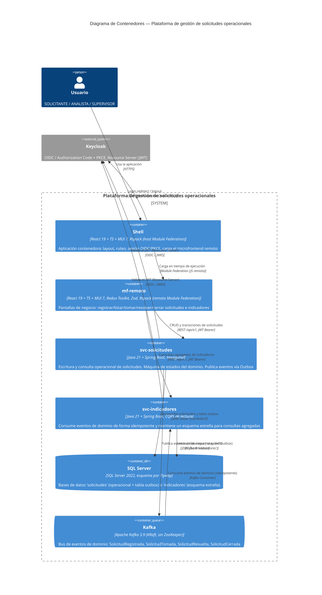

# C4 — Nivel 2: Contenedores

Despliegue de la vista de contexto en los contenedores que componen el stack local
(`docker compose up --build`): el **shell** React (host de Module Federation) que carga en
tiempo de ejecución el **microfrontend** remoto; dos servicios backend con arquitectura
hexagonal (**svc-solicitudes** para escritura/consulta operacional, **svc-indicadores** para
consultas agregadas de solo lectura); **SQL Server** como persistencia de ambos (bases de
datos separadas: `solicitudes` e `indicadores`); **Kafka** como bus de eventos entre ambos
servicios vía patrón Outbox; y **Keycloak** como IdP compartido.

## Notas

- **Shell vs. microfrontend:** el shell es el host de Module Federation (layout, ruteo,
  sesión); `mf-remoto` es el remoto que expone las pantallas de negocio y se integra en
  tiempo de ejecución (no en tiempo de build). Ambos son contenedores separables aunque se
  desplieguen desde el mismo monorepo.
- **Outbox → Kafka:** `svc-solicitudes` no publica a Kafka dentro de la misma transacción de
  negocio; escribe el evento en una tabla `outbox` (misma base `solicitudes`, misma
  transacción) y un relay lo publica a Kafka de forma confiable (at-least-once). El detalle
  del flujo está en [`secuencia-flujo-principal.md`](./secuencia-flujo-principal.md).
- **Idempotencia en el consumidor:** `svc-indicadores` procesa cada evento a lo sumo una vez
  a nivel de efecto (deduplicación por identificador de evento), tolerando reintentos y
  redelivery de Kafka.
- **Bases de datos separadas:** `solicitudes` (modelo operacional + outbox) e `indicadores`
  (esquema estrella) viven en la misma instancia de SQL Server pero son bases independientes;
  no hay acceso cruzado directo entre servicios a nivel de datos, solo vía eventos.
- **Puertos locales** (`docker-compose.yml`): shell/mf-remoto (Fase 4, sin puerto aún fijado),
  `svc-solicitudes` en `SVC_SOLICITUDES_PORT` (default 8080), `svc-indicadores` en
  `SVC_INDICADORES_PORT` (default 8082), Keycloak en 8081, SQL Server en 1433, Kafka interno
  en `kafka:9092` (red `ps-net`, sin puerto expuesto al host).
