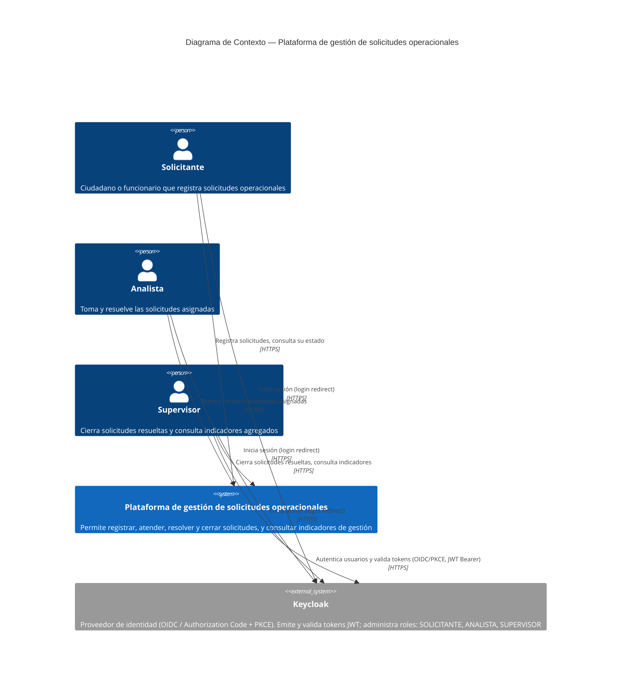

# C4 — Nivel 1: Contexto

Vista de más alto nivel de la **Plataforma de gestión de solicitudes operacionales**:
quién la usa y con qué sistema externo interactúa. Los tres roles de negocio
(SOLICITANTE, ANALISTA, SUPERVISOR) acceden a la misma aplicación web (shell + microfrontend);
la autenticación/autorización se delega en **Keycloak** como proveedor de identidad (OIDC).
La plataforma en sí se representa como una sola caja: el detalle de sus contenedores
internos está en [`c4-contenedores.md`](./c4-contenedores.md).

## Notas

- Los tres roles comparten la misma URL de la aplicación (shell React); lo que ven y pueden
  hacer se determina por el rol asignado en Keycloak y validado en el backend (RBAC en servidor).
- Keycloak es el único sistema externo del contexto: no hay integraciones con terceros en
  esta fase del proyecto.
- El flujo de estados de una solicitud (REGISTRADA → EN_ATENCION → RESUELTA → CERRADA) está
  detallado en [`secuencia-flujo-principal.md`](./secuencia-flujo-principal.md).
