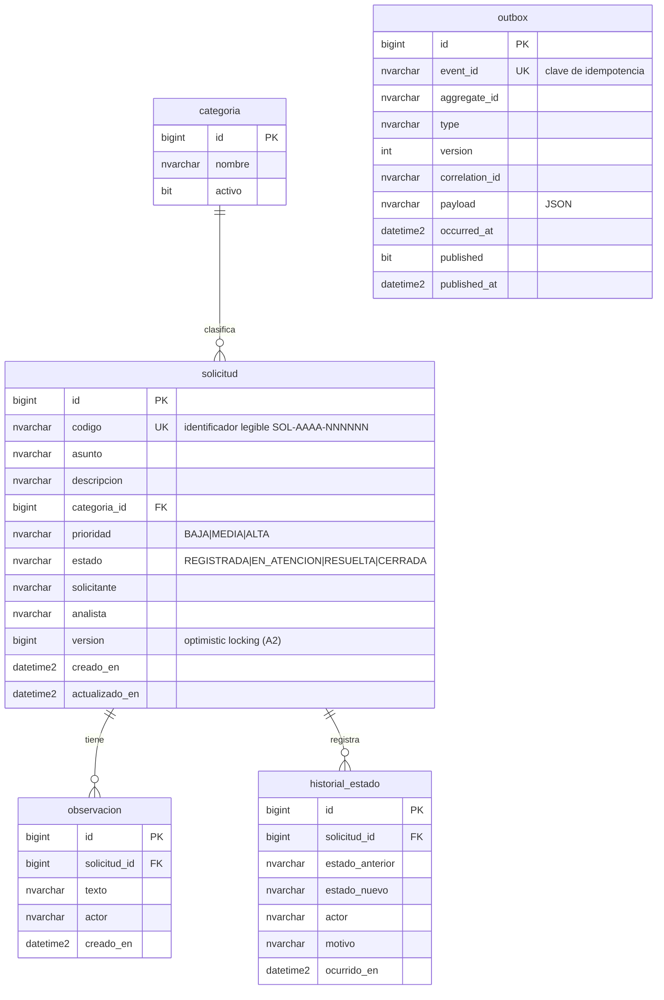
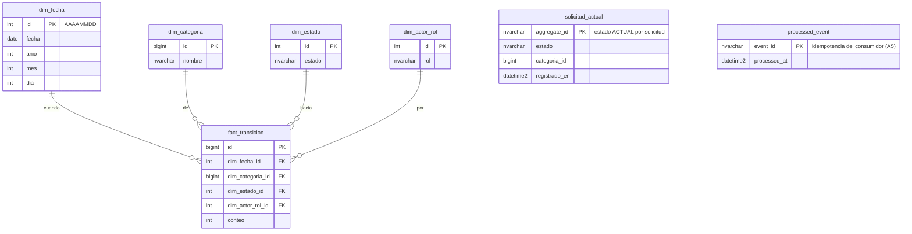

# Modelo de datos

Dos modelos separados, cada uno en su base de datos SQL Server, propiedad de **Flyway**
(`ddl-auto=validate`, Hibernate nunca crea/altera tablas).

---

## 1. Modelo operacional (normalizado) — base `solicitudes`

Servicio **svc-solicitudes**. Optimizado para escritura consistente y trazabilidad.
Migraciones: `backend/svc-solicitudes/src/main/resources/db/migration/V1__baseline_operacional.sql`
(+ `V2__seed_categorias.sql`).

- **`historial_estado`** da trazabilidad completa: cada transición conserva actor, fecha y motivo.
- **`outbox`** implementa la publicación confiable de eventos (patrón Outbox).

---

## 2. Modelo analítico (estrella) — base `indicadores`

Servicio **svc-indicadores** (CQRS de lectura). Optimizado para consultas agregadas.
Migraciones: `backend/svc-indicadores/src/main/resources/db/migration/V1__baseline_estrella.sql`
(+ `V2__read_model_estado_actual.sql`). Evita replicar datos personales innecesarios
(solo el rol del actor, no su identidad).

- **`fact_transicion`** (tabla de hechos) alimenta la **tendencia diaria**.
- **`solicitud_actual`** mantiene el estado vigente de cada solicitud → conteos exactos
  **por estado** y **por categoría** (modelo de lectura CQRS).
- **`processed_event`** garantiza el consumo idempotente (un `eventId` no se cuenta dos veces).

---

## Diferencia operacional vs. analítico

| Aspecto | Operacional (`solicitudes`) | Analítico (`indicadores`) |
|---|---|---|
| Propósito | Escritura consistente, reglas de negocio | Consultas agregadas de solo lectura |
| Normalización | Normalizado (3FN) | Estrella (hechos + dimensiones) |
| Fuente de la verdad | Sí (comandos) | Derivado de eventos |
| Actualización | Transaccional | Asíncrona (consumo de eventos Kafka) |
