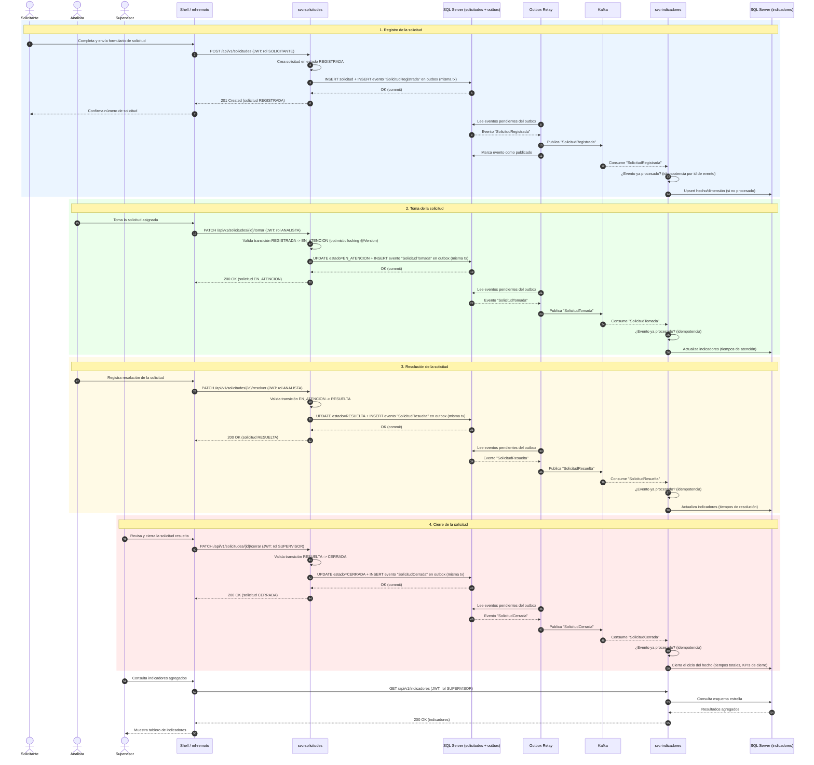

# Diagrama de secuencia — Flujo principal de una solicitud

Recorrido completo de una solicitud operacional a través de sus cuatro estados
(REGISTRADA → EN_ATENCION → RESUELTA → CERRADA), sin saltarse ninguno (regla de dominio A4).
Cada transición se persiste en la misma transacción de negocio junto con un evento en la
tabla **Outbox** de `svc-solicitudes`; un relay publica esos eventos a **Kafka**, y
**svc-indicadores** los consume de forma **idempotente** para mantener su esquema estrella
actualizado. Los tres roles (SOLICITANTE, ANALISTA, SUPERVISOR) participan cada uno en el
paso que le corresponde.

## Notas

- **Sin saltos de estado (A4):** cualquier intento de transición inválida (por ejemplo,
  REGISTRADA → RESUELTA directamente) es rechazado por el dominio (`Estado.puedeTransicionarA`)
  con una excepción de dominio, antes de tocar la base de datos.
- **Outbox como garantía de entrega:** el evento se escribe en la misma transacción que el
  cambio de estado, así que nunca hay un cambio de estado sin su evento correspondiente (ni
  viceversa). El relay reintenta la publicación a Kafka hasta confirmarla.
- **Idempotencia en `svc-indicadores` (A5):** Kafka garantiza *at-least-once*, por lo que el
  consumidor deduplica por identificador de evento antes de aplicar el efecto sobre el
  esquema estrella, evitando duplicar hechos ante redelivery o reprocesamiento.
- **Concurrencia (A2):** el `@Version` (optimistic locking) en `svc-solicitudes` evita que
  dos analistas tomen la misma solicitud simultáneamente; el segundo intento recibe un
  conflicto de concurrencia.
